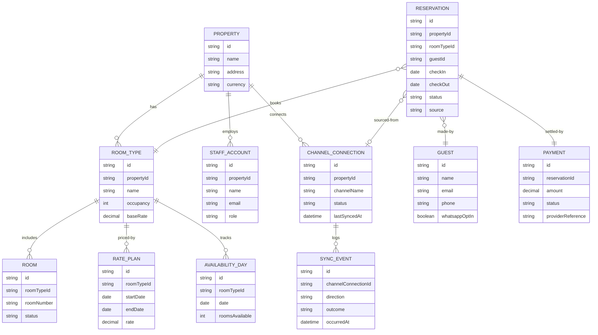

# Domain Model

The core entities behind property, room, rate, availability, channel-sync and reservation management.

- A `RESERVATION`'s `source` distinguishes direct bookings from a given `CHANNEL_CONNECTION`.
- `SYNC_EVENT` records both push (rate/availability out) and pull (booking in) sync activity, so failures and history are visible per channel.
- `GUEST.whatsappOptIn` gates the optional WhatsApp notification alongside the always-sent email.

