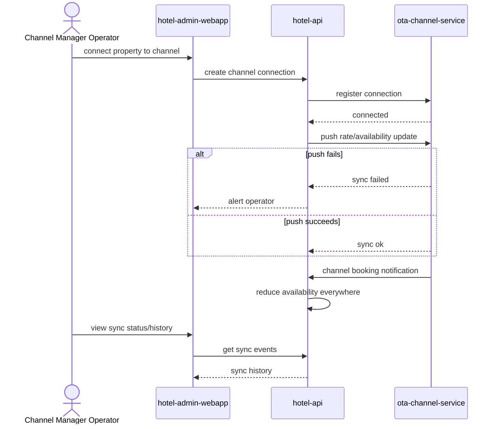

# Channel Sync

A Channel Manager Operator connects a property to an OTA channel; the system then keeps rates/availability pushed out and pulls channel bookings back in, alerting on sync failures.

