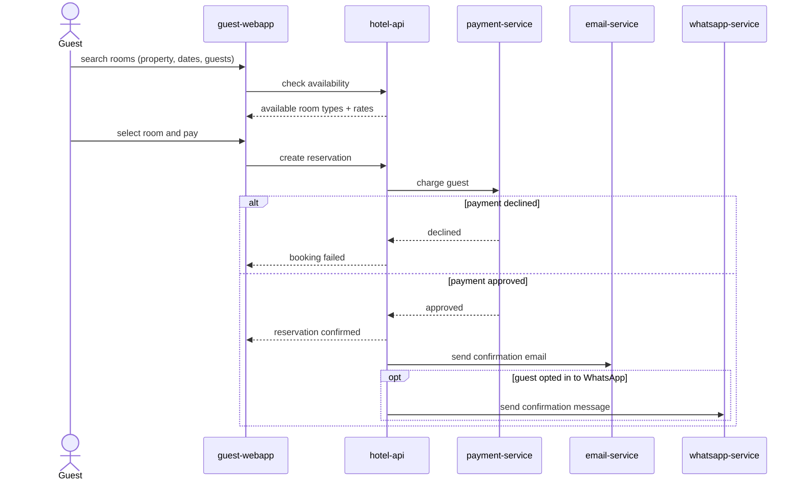

# Guest Booking

A Guest searches for a room, books it, pays online, and receives a confirmation.

```mermaid
sequenceDiagram
    actor Guest
    participant guestwebapp as guest-webapp
    participant hotelapi as hotel-api
    participant paymentservice as payment-service
    participant emailservice as email-service
    participant whatsappservice as whatsapp-service

    Guest->>guestwebapp: search rooms (property, dates, guests)
    guestwebapp->>hotelapi: check availability
    hotelapi-->>guestwebapp: available room types + rates
    Guest->>guestwebapp: select room and pay
    guestwebapp->>hotelapi: create reservation
    hotelapi->>paymentservice: charge guest
    alt payment declined
        paymentservice-->>hotelapi: declined
        hotelapi-->>guestwebapp: booking failed
    else payment approved
        paymentservice-->>hotelapi: approved
        hotelapi-->>guestwebapp: reservation confirmed
        hotelapi->>emailservice: send confirmation email
        opt guest opted in to WhatsApp
            hotelapi->>whatsappservice: send confirmation message
        end
    end
```

