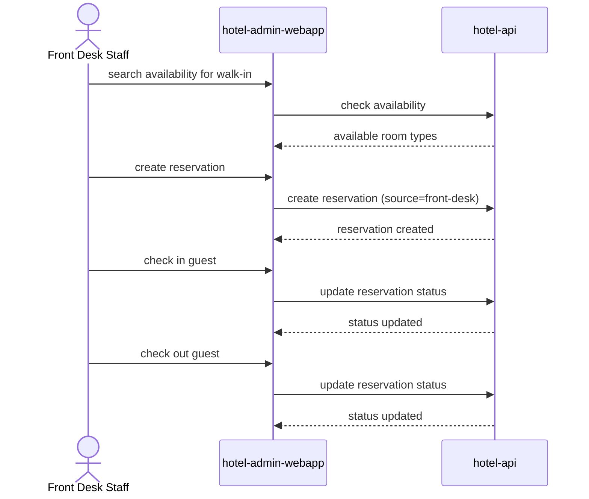

# Staff Reservation Management

Front Desk Staff creates a walk-in reservation and manages it through check-in and check-out.

```mermaid
sequenceDiagram
    actor Staff as Front Desk Staff
    participant adminwebapp as hotel-admin-webapp
    participant hotelapi as hotel-api

    Staff->>adminwebapp: search availability for walk-in
    adminwebapp->>hotelapi: check availability
    hotelapi-->>adminwebapp: available room types
    Staff->>adminwebapp: create reservation
    adminwebapp->>hotelapi: create reservation (source=front-desk)
    hotelapi-->>adminwebapp: reservation created
    Staff->>adminwebapp: check in guest
    adminwebapp->>hotelapi: update reservation status
    hotelapi-->>adminwebapp: status updated
    Staff->>adminwebapp: check out guest
    adminwebapp->>hotelapi: update reservation status
    hotelapi-->>adminwebapp: status updated
```

